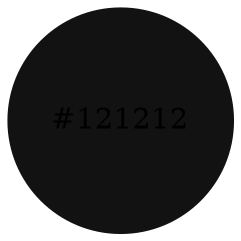
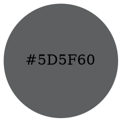
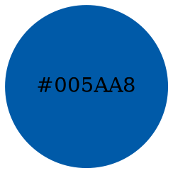
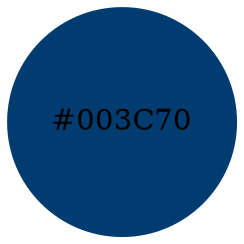
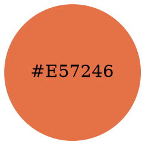
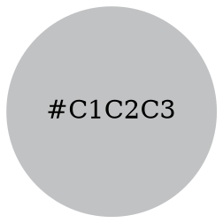
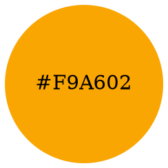
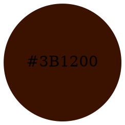
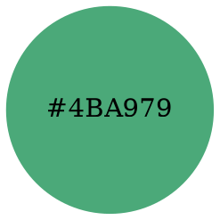
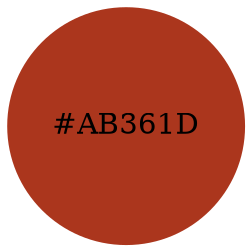

# 顏色 (Color)

## 規範

### 色彩對比度
在替所製作的數位系統選用色彩時，我們必須符合色彩對比度 WCAG AA 等級或更高級別。以下列出幾個可以用來檢查對比度是否足夠的工具：
[Snook.ca顏色對比檢查](https://snook.ca/technical/colour_contrast/colour.html#fg=33FF33,bg=333333)，[Webaim 顏色對比檢查器](https://webaim.org/resources/contrastchecker/)、[TPG顏色對比分析器](https://www.tpgi.com/color-contrast-checker/)、[對比度網站-Contrast ratio](https://contrast-ratio.com) 或 [Android無障礙掃描工具](https://support.google.com/accessibility/android/answer/6376570?hl=en-GB)。

要注意的是，字型大小也會是影響對比度的變因。舉例來說，有時雖然文字色與背景色通過上述色彩對比度檢測，但若文字的字型縮小時，雖顏色不變，可能必須得將字重加大才能通過對比度檢測。您可以使用下列工具來檢查：[Adobe 色彩對比度分析器](https://color.adobe.com/create/color-contrast-analyzer)。

## 參考顏色
我們挑選出一組顏色作為參考，以下的顏色組合已經符合色彩對比度的規定。

### 文字 (Text)

#### 預設文字色 (Primary text color)

#### 次要文字色 (Secondary text color)

#### 背景色 (Background color)

### 連結 (Link)

#### 預設 (Default)

#### [hover中文] (Hover)

#### [visited中文] (Visited)

### 邊框 (Border)

#### [預設邊框] (Default border)

#### 輸入欄位框 (Input border)

### 聚焦狀態 (Focus state)

#### 聚焦背景 (Focused background)

#### 聚焦文字 (Focused text)

### 成功狀態 (Success state)

### 錯誤狀態 (Error state)

### 品牌顏色 (Brand color)

