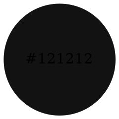
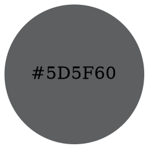

# 顏色

## 規範

### 色彩對比度
您應確保在您所製作的數位系統介面上，所選用的文字顏色比背景顏色的**色彩對比度大於 7:1**。

## 建議顏色

### 文字 (Text)

#### 主要色 (Primary)

#### 次要色 (Secondary)

#### 背景色 (Background)
#FFFFFF

### 連結 (Link)

### 邊框 (Border)

### 聚焦狀態 (Focus state)

### 成功狀態 (Success state)

### 品牌顏色 (Brand color)

